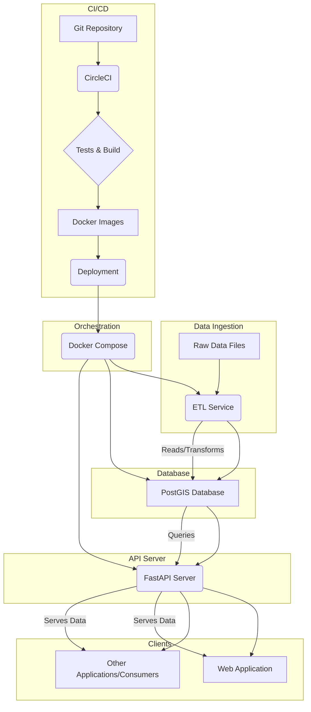

# Self-Served Geospatial Data Application

This repository contains the source code for a complete, self-served geospatial data application. It demonstrates a full-stack, containerized workflow: from raw data ingestion and processing to storage in a PostGIS database and exposure via a high-performance FastAPI REST API.

This project is the result of the blog post series:

Part 1: The Database and ETL
Part 2: The API and CI/CD

### 🏛️ Application Architecture
This diagram illustrates the complete application architecture, from data ingestion to CI/CD.


- **Data Flow**: Raw data files are processed by an ETL Service, which transforms and loads the data into a PostGIS Database. A FastAPI Server queries this database to serve the data to clients (like a web app).
- **Infrastructure & CI/CD**: The entire system is orchestrated by Docker Compose. A CircleCI pipeline automatically builds, tests, and prepares the services for deployment from the Git Repository.

### ✨ Features
- **Automated ETL**: A containerized service to process raw data files.
- **Geospatial Database**: Uses PostGIS for robust spatial data storage and querying.
- **High-Performance API**: Built with FastAPI for modern, asynchronous API endpoints.
- **Database Migrations**: Manages database schema changes with Alembic.
- **Containerized**: Fully containerized with Docker and orchestrated with Docker Compose for easy, cross-platform deployment.
- **Automated Testing**: Unit tests for the API service layer using pytest.
- **Continuous Integration**: A complete CI pipeline with CircleCI that builds, runs migrations, and tests the application on every commit.


### 🛠️ Tech Stack
- Backend: Python 3.10+, FastAPI
- Database: PostgreSQL with PostGIS, SQLAlchemy (ORM), Alembic (Migrations)
- Geospatial: Shapely, GDAL (as a system dependency)
- Containerization: Docker, Docker Compose
- Testing: Pytest
- CI/CD: CircleCI
- Dependency Management: Poetry

🚀 Getting Started
#### Prerequisites
- Docker
- Docker Compose

#### Local Installation & Setup
1. Clone the repository:

```bash
git clone git@github.com:geotechblogs/spatial_etl_app.git
cd spatial_etl_app
```
2. **Configure Environment**: This project uses environment variables managed by docker-compose.yml. Key variables like DATABASE_URL are passed to the services. You can create a .env file in the root directory to override defaults (e.g., POSTGRES_USER, POSTGRES_PASSWORD).

3. **Build and Run the Application**: This single command builds the images for the ETL service, the database, and the FastAPI server, then starts all containers.

```bash
docker-compose build
```

```bash
docker-compose up -d
```
- The -d flag runs the containers in detached mode.

4. **How it works on startup**:
- docker-compose starts all services defined in docker-compose.yml.
- The postgis_db service will initialize.
- The etl_service will run, execute its app.py script, populate the database, and then exit.
- The fastapi service will start, connecting to the now-populated database.

5. **Access the API**: Once running, the API is available at http://localhost:3200.
- API Docs: http://localhost:3200/docs (Swagger UI)
- All Locations: http://localhost:3200/locations

### 📡 API Endpoints
The API server provides the following main endpoints:
- GET /: Simple health check.
- GET /locations: Retrieves all spatial locations in a GeoJSON-compatible format.
- GET /locations/{org_id}: Retrieves all spatial locations for a specific org_id in a GeoJSON-compatible format.

### 🧪 Testing
Tests are located in the server_app/tests directory and are run using pytest.
You can run tests locally by executing pytest within the running API server container:
```bash
# Find the name of your api server container
docker ps

# Exec into the container
docker exec -it <api_container_name> /bin/bash

# Run tests from within the container
# (Assuming poetry is installed in the container)
poetry run pytest .
```
Alternatively, the tests are run automatically by the CircleCI pipeline on every push.

### 📁 Project Structure
```
.
├── .circleci/             # CircleCI pipeline configuration (config.yml)
├── etl_service/           # ETL service, data, and Dockerfile
│   ├── app.py             # Main ETL script
│   ├── data/              # Raw data files
│   └── Dockerfile
├── server_app/            # FastAPI server application
│   ├── config/            # Database configuration (database.py)
│   ├── models/            # SQLAlchemy models (spatial_locations.py)
│   ├── routes/            # API routes (spatial_endpoints.py)
│   ├── services/          # Business logic (spatial_locations.py)
│   ├── tests/             # Pytest tests
│   ├── alembic/           # Alembic migration files
│   ├── alembic.ini        # Alembic config
│   ├── main.py            # FastAPI app entrypoint
│   ├── Dockerfile
│   └── pyproject.toml     # Poetry dependencies
├── docker-compose.yml     # Orchestrates all services
└── README.md              # You are here!
```
License
This project is licensed under the MIT License. See the LICENSE file for details.
